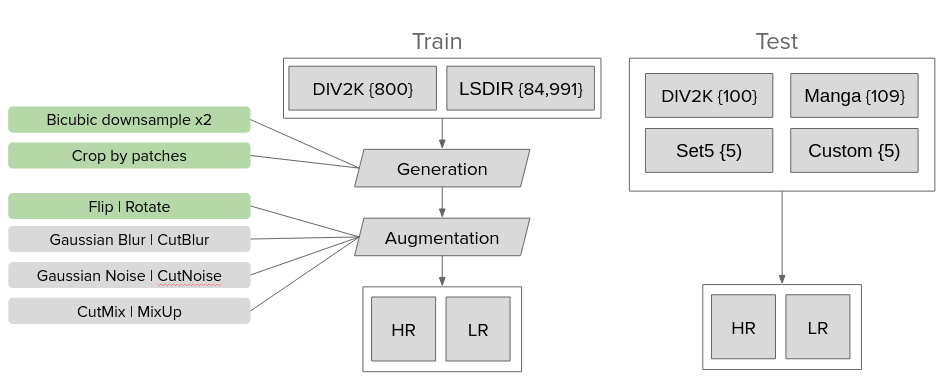
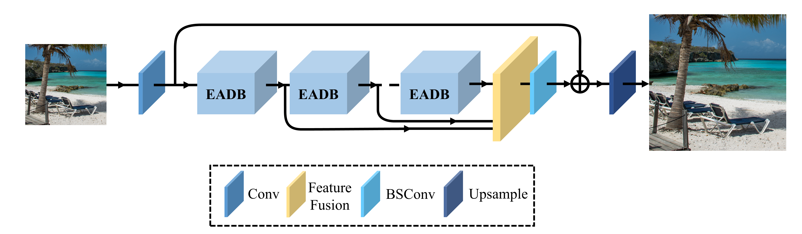
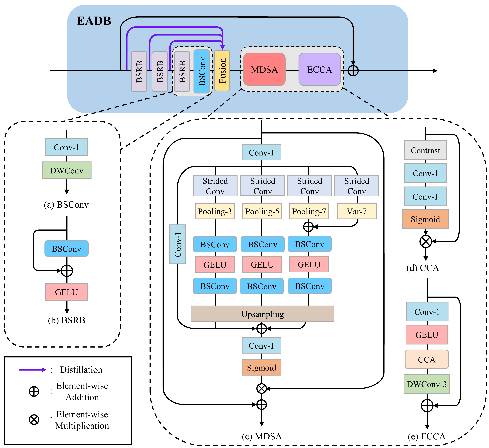
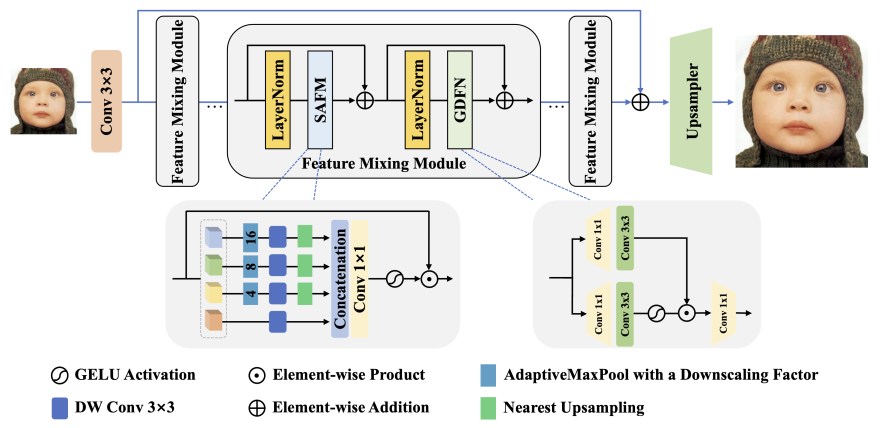
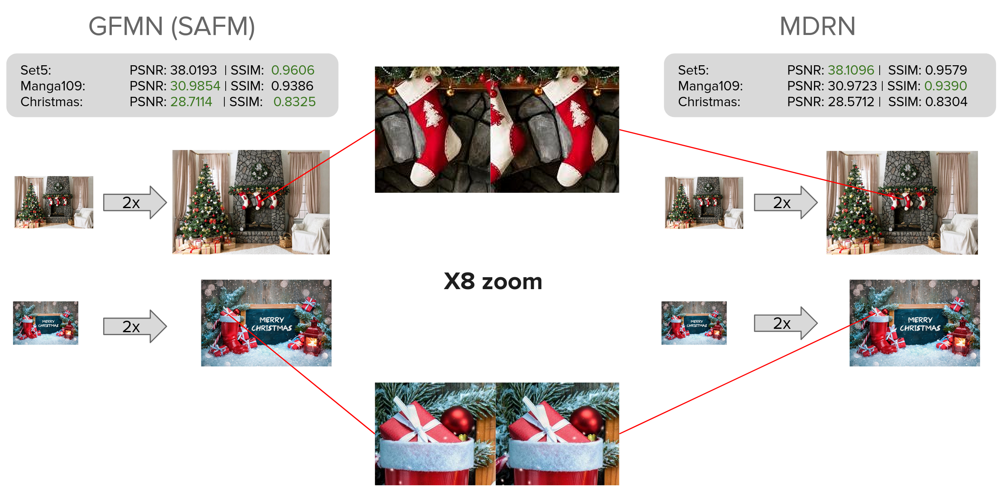
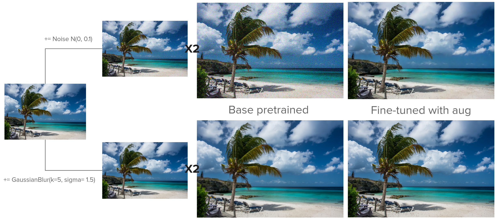
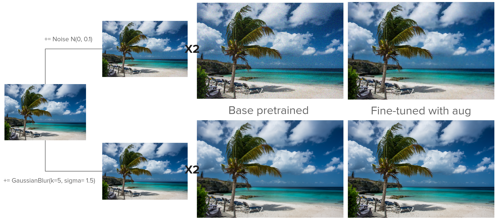

# Computer Vision Lab. Image Super Resolution Task 2023
## Contents
- [Introduction](#introduction)
- [Data](#data)
  - [Training Data](#training-data)
  - [Test Data](#test-data)
- [Architectures](#architectures)
  - [MDRN](#mdrn)
  - [GFMN](#gfmn)
- [Demo Results](#demo-results)
- [Experiments](#experiments)
  - [Addition tasks](#addition-tasks)
  - [Losses modification](#losses-modification)
- [Setup and Reproducibility](#setup-and-reproducibility)
- [Links](#links)
- [Project structure](#project-structure)

## Introduction
A study of the result of the Image Super Resolution NTIRE 2023 competition. Study and comparison of MDRN and GFMN models. Experimental improvement of models quality.

## Data

### Training data
Data from the DIV2K and LSDIR public datasets are used to train the models. DIV2K dataset consists of 1,000 diverse 2K resolution RGB images, which are split into a training set of 800 images, a validation set of 100 images,and a test set of 100 images. LSDIR dataset contains 86,991 high-resolution high-quality images, which are split into a training set of 84,991 images, a validation set of 1,000 images, and a test set of 1,000.

### Test data
There are 4 datasets used to test the quality of models: DIV2K test dataset, Manga109 containing comics images, publicly available dataset for Super Resolution quality test Set5 and custom dataset Christmas.


# Architectures

### **MDRN**

**Multi-level Dispersion Residual Network (MDRN).** NTIRE 2023 winner under:
- Number of parameters.
- FLOPS.




### **GFMN**

**Gated feature modulation network (GFMN).** NTIRE 2023 3rd place under:
- Number of parameters.
- FLOPS.



# Demo Results
Pretrain models inference on test sets PSNR | SSIM results:



# Experiments
### Addition tasks

| PSNR metric        | DIV2k Blur | Noise  | Manga109 Blur | Noise  | Set5 Blur | Noise  | Christmas Blur | Noise  |
|--------------------|------------|--------|---------------|--------|-----------|--------|----------------|--------|
| MDRN base          | 27.1961    | 21.6181| 25.1616       | 21.5454| 26.3798   | 21.7238| 24.6929        | 20.9387|
| MDRN fine-tuned    | **33.8330**| **30.8184**| **30.5301** | **29.3575**| **34.6285** | **31.0261**| **28.5631** | **27.4755**|
| GFMN (SAFM) base   | 27.1902    | 21.9179| 25.1580        | 22.0246| 26.3741   | 22.1374| 24.6895        | 21.2976|
| GFMN (SAFM) fine-tuned |32.7189| 30.4988| 29.6930 | 28.3714| 33.1904 | 30.6769| 28.0334 | 27.3378|

**MDRN fine-tune results:**

**GFMN fine-tune results:**


# Setup and Reproducibility
### Setup
- The list of dependencies is located in the `requirements.txt` file.
- [PyTorch >= 1.9](https://pytorch.org/)
- [Python 3.7](https://www.python.org/downloads/)
- [Numpy](https://numpy.org/)
- [BasicSR >= 1.3.4.9](https://github.com/XPixelGroup/BasicSR)
  
```
pip install -e .
pip install -r requirements.txt
```
### Reproducibility
**data extraction**

In order to effectively improve the training speed, images are cropped to 480 * 480 images by running script extract_subimages.py, and the dataloader will further randomly crop the images to the GT_size required for training. GT_size defaults to 128/192/256 (×2/×3/×4). 

```python
python extract_subimages.py
```

The input and output paths of cropped pictures can be modify in this script. Default location: ./datasets/DL2K.

**train**

```python
python train.py -opt ./options/train/MDRN/train_mdrn_x2.yml --auto_resume
python train.py -opt ./options/train/SAFM/train_safm_x2.yml --auto_resume
```

**test**

```python
python basicsr/test.py -opt ./options/test/MDRN/test_mdrn_x2.yml
python basicsr/test.py -opt ./options/test/SAFM/test_safm_x2.yml
```
# Links
**Main papers**
- [NTIRE2023](https://openaccess.thecvf.com/content/CVPR2023W/NTIRE/papers/Li_NTIRE_2023_Challenge_on_Efficient_Super-Resolution_Methods_and_Results_CVPRW_2023_paper.pdf)
- [MDRN](https://openaccess.thecvf.com/content/CVPR2023W/NTIRE/papers/Mao_Multi-Level_Dispersion_Residual_Network_for_Efficient_Image_Super-Resolution_CVPRW_2023_paper.pdf)
- [GFMN](https://openaccess.thecvf.com/content/ICCV2023/papers/Sun_Spatially-Adaptive_Feature_Modulation_for_Efficient_Image_Super-Resolution_ICCV_2023_paper.pdf)

# Project structure
```
├── basicsr              # directory with main modules for image super resolution task
│   ├── archs            # architectures module
│   ├── data             # data processing module
│   ├── losses           # loss functions
│   ├── metrics          # SR metrics
│   ├── models           # models utils
│   ├── ops              # useful functions
│   └── utils            # preprocessing and postprocessing utils
degradations             # directory with degradation scripts
│   ├── conf             # configurations
│   └── degradations     # image degradations module
├── options              # options for train and test scripts
│   ├── test
│   │   ├── MDRN
│   │   ├── SAFMN
│   │   └── SRN
│   └── train
│       ├── MDRN
│       ├── SAFM
│       └── SRN
├── pretrain_models      # saved models weights
│   ├── mdrn
│   ├── safm
│   └── srn
├── utility              # helper functions for models evaluations
├── extract_subimages.py # script for image patching
├── requirements.txt     # The requirements file
└── setup.py             # Setup script to make the project pip-installable

```

